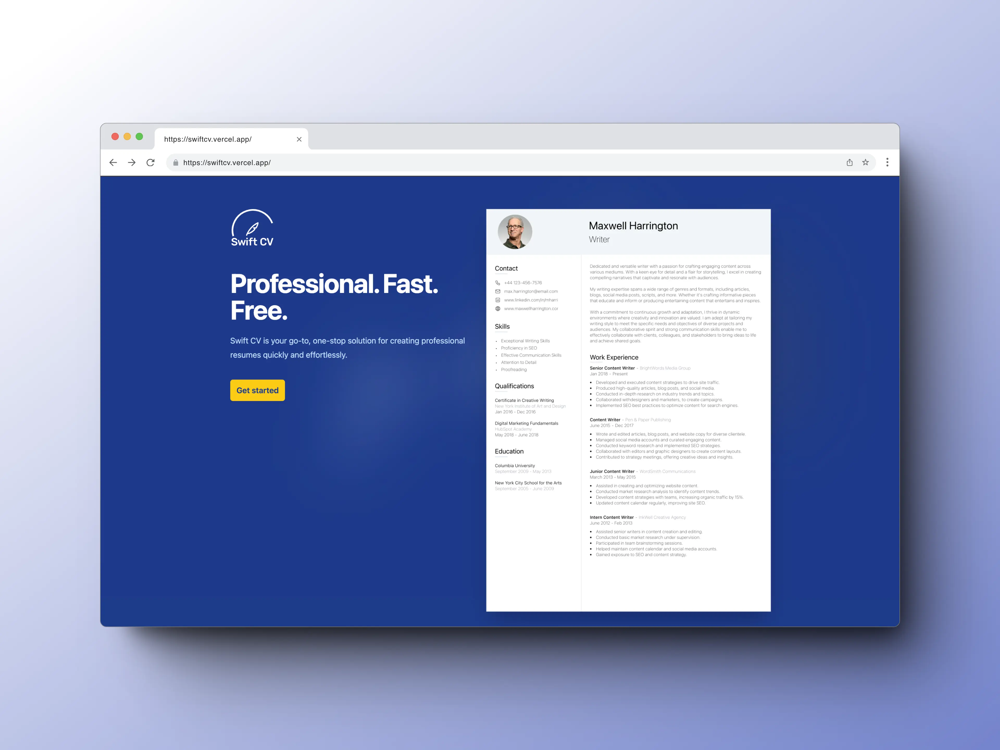
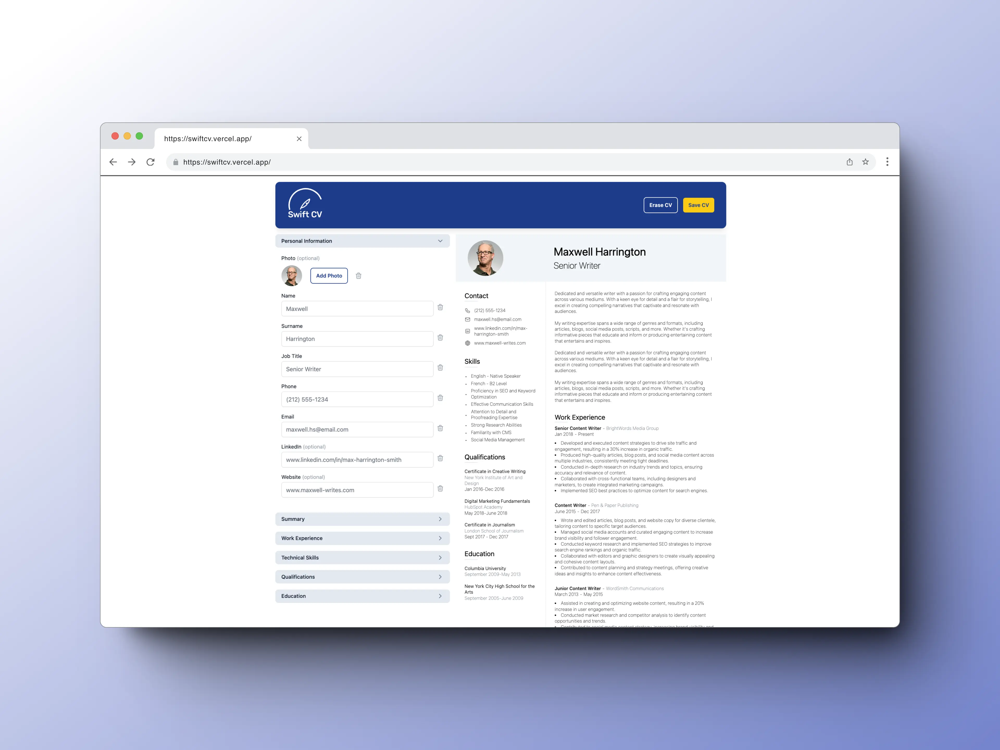

## Swift CV

1. [Description](#description)
2. [Demo](#demo)
3. [Design](#design)
4. [Features](#features)
5. [Technologies Used](#technologies-used)
6. [Project Challenges](#project-challenges)
7. [Thoughts & Observations](#thoughts-and-observations)
8. [Future Enhancement Ideas](#future-enhancement-ideas)
9. [Installation](#installation)

## Description

My first foray into React creating a CV Builder app: Swift CV. The primary objective of this project was to familiarize myself with React's fundamental concepts and syntax, leveraging state to manage data and dynamically update UI components.

The app is divided into two main sections: the input section and the CV preview section. In the input section, users can enter their personal information, work experience, education, and other relevant details. As the user inputs their data, the app dynamically generates a stylized CV in the preview section, providing a real-time visualization of how the final document will appear.

Users can then save or print their CV as a PDF file, allowing them to easily share it with potential employers or store for future reference.

## Demo

Click here: [https://swiftcv.vercel.app/](https://swiftcv.vercel.app/)

## Design

<div align='center'>

</div>
<div align='center'>

</div>

## Features

- CV photo upload feature.
- Builds a structured and professionally presented CV.
- Users can dynamically generate additional input fields.
- Delete and update CV data.
- Utilizes local storage to persist data, allowing users to save their work while avoiding privacy concerns.
- Print and save the CV as a PDF (currently only for desktop version).

## Technologies Used

- React
- JavaScript
- Tailwind
- Vite
- NPM
- Vercel

## Project Challenges

Creating this project posed several beginner related challenges that pushed my understanding of React.

Initially, grasping how the app's functionality would come together was a hurdle, leading me to explore different trial and error approaches and plenty of refactoring to find my solution.

Implementing dynamic input fields was particularly challenging, requiring me to research concepts such as UUIDs to prevent duplicate elements. However, I found myself quickly overcomplicating the process.

In retrospect, I realize that I focused too much on trying to create modular code following the Single Responsibility Principle (SRP) before really establishing the core functionality.

This led me to refactor the code as I re-evaluated my approach midway through the process. My error here was beginning the project without a defined plan of how I wanted the app to function. This understanding evolved as I developed, which I allowed myself the freedom to do, but it certainly wasn't an efficient way of working.

## Thoughts and Observations

Looking back, I believe that I should have granted myself more flexibility and written code that might have been initially "messy" but could have sped up the development process.

By first establishing a functional app, I could have then refactored and optimized the codebase for modularity once the core functionality was in place. This experience taught me the importance of finding a balance between clean code principles and pragmatic development practices.

One of the key lessons I took away from this project was the importance of setting clear goals and defining the scope before moving into the development process. By having a more well-defined roadmap, I could have streamlined my efforts and avoided unnecessary detours or complications along the way.

In this project, I allowed myself to experiment and explore, trying out new technologies and development approaches, deviating into some basic branding by creating a logo and a simple landing page in an effort to make it a more rounded project.

It was a great experience in which I learned a lot. As is the nature of such projects, iterating as the project evolves is also a valuable skill to develop.

However, the concept for the app was initially envisaged purely for desktop use. I later attempted to make it more compatible with mobile devices, following user data derived from Vercel analytics, highlighting that around 50% of users were accessing the app from mobile devices. Accommodating this after establishing the app's overall design presented several challenges in terms of layout. As a result, while usable, the current mobile implementation is not fully optimized, and it is an area that I want to revisit and improve upon in the future.

I believe this project has a lot of potential for further development as I continue to expand my knowledge and familiarity with React.

After I progress and work on some additional projects, I would like to return to this one and continue its development, incorporating the new skills and techniques I acquire along the way.

## Future Enhancement Ideas

- Enhance mobile responsiveness for better usability on mobile devices.
- Introduce customization options, allowing users to personalize their CVs with different font choices, colors and layout designs to better suit their preferences.
- Implement a user authentication system to allow users to log in and securely save their work rather than relying on local storage, enabling them to store and modify their CVs.
- Refactor codebase to be more modular.

## Installation

To set up Swift CV locally, please follow these steps:

1. Clone the GitHub repository to your local machine:

   ```bash
   git clone git@github.com:scottwright-dev/swift-cv.git
   ```

2. Navigate to the project's directory:

   ```bash
   cd swift-cv
   ```

3. Install the project's dependencies using npm:

   ```bash
   npm install
   ```

4. To build the project:

   ```bash
   npm run build
   ```
